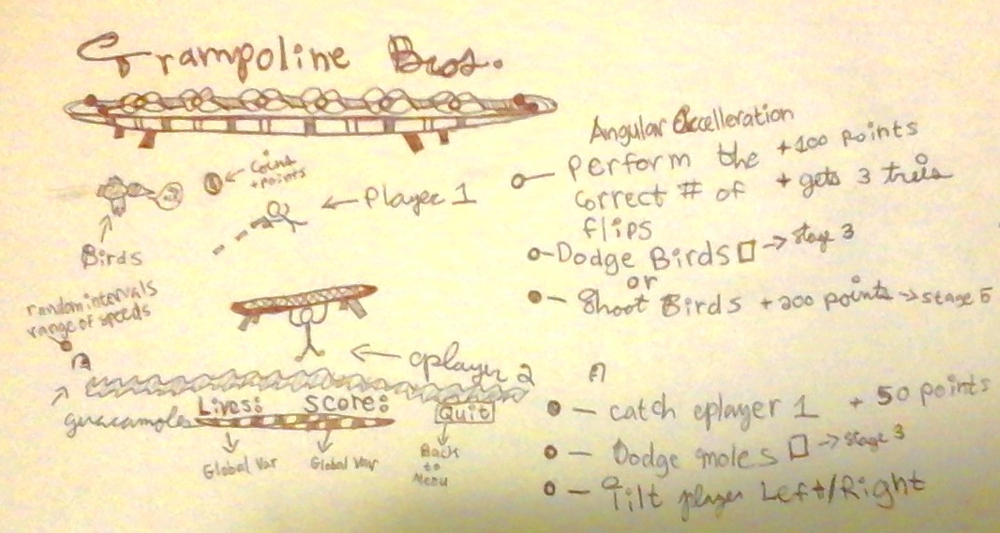

# Trampoline Bros!

## Link To Game

<http://gschnall.github.io/trampoline_bros/>

## Synopsis

Trampoline Bros! is meant to be a 2-player co-op game with the optional challenge to play as a single player. The goal of the game is to increase your score by performing flips and collecting bats. Players are given 3 lives. The player looses life if they perform a flip incorrectly, don't land on their feet, miss the trampoline, or get eaten by a rat. The game is project 1 for my web development immersive program.

## Story

Kylebert wants to Practice his flip routine and commands squirt the alien to drag his trampoline. Squirt decides to go along with these shenanigans as long as he can use Kylebert to get him bats. He's hungry and bats are his favorite food. Unfortunately, rats also like bats and, if given the chance, they'll eat little aliens too. Squirt has a bad feeling about this but decides to forgo his instincts over his growling stomach.

## How To Play

- Control Player one's rotation (The Dude Jumping in The Air) with the left and right arrow keys.
- Use W, A, and D to control Player 2 (The Little Alien). If you move Right or Left as Player 1 lands. You'll Propell Player 1 Right or Left As well.

### How to Score Points
- Complete the current flip.
- Use Player 1 to knock down Bats and Player 2 to collect them.
- Stay alive long enough to do both of the aforementioned things.

### How to Loose Lives
- Land incorrectly on the trampoline
- Don't land on the trampoline at all
- If Player 2 (The Little Alien Dragging the Trampoline) gets eaten by a rat, you loose.
- You really want to make sure Player 2 jumps over the rat. Player 1 will Shout out "RAT!!!" if there is one.

### Tips and Tricks
- To better move player 1, player 2 can bounce player 1 off of the side boundries.
- Be gentle with player 1 arrow keys. A little rotation can go a long way around.
- A good strategy is to lightly tap the arrow keys a little at a time; giving yourself the ability to judge the rotational speed.
- collecting bats almost always attracts rats. Rats arrive from the left hand side of the screen.

## Motivation

This is my attempt at learning Phaser. My goal is to sculpt this wacky indie adventure into an HTML5 classic smartphone and tablet game.

## Installation

- Download the zip
- Navigate to the Project Directory in your terminal
- Phaser.js requires a server to work locally
- start the server from inside the termal and navigate to the port in your browser
- I use python: ** python -m SimpleHTTPServer **.
- Note: if using python 3 or above, the command is: **  python3 -m http.server **

## Libraries

The only library the game uses is Phaser. No jQuery is required.

<http://www.phaser.io>

## Original Game Design

[]
